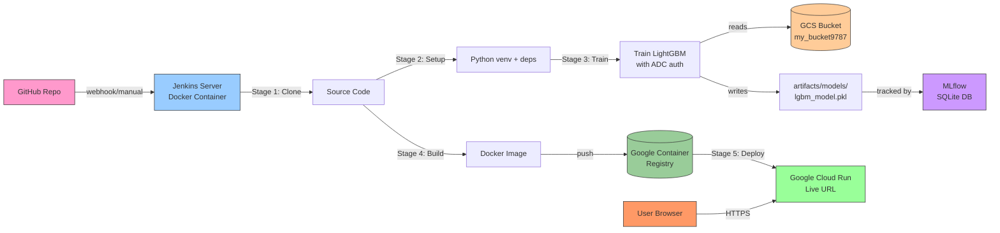
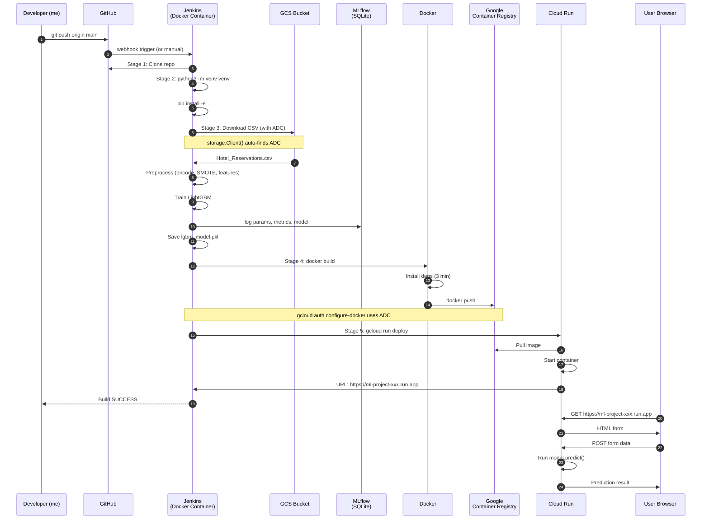
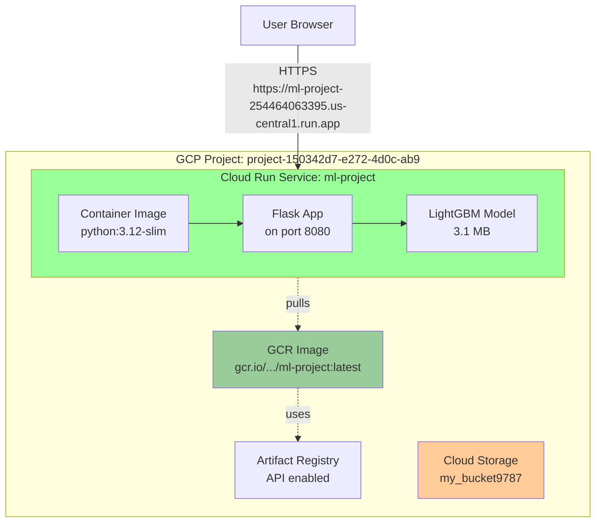

# Hotel Reservation MLOps — Complete Project Reference

> **A production-grade, end-to-end MLOps pipeline**: from raw data to a live public prediction API on Google Cloud Run, with full CI/CD automation through Jenkins, Docker, and Google Container Registry.

> **Last updated:** 2026-07-22
> **Project:** Hotel Reservation Cancellation Prediction
> **Author:** Safwen Cherif
> **Status:** ✅ **Deployed to production** — [https://ml-project-254464063395.us-central1.run.app](https://ml-project-254464063395.us-central1.run.app)

---

## 📑 Table of Contents

1. [Project Overview](#1-project-overview)
2. [System Architecture](#2-system-architecture)
3. [The Environment](#3-the-environment)
4. [Component Walkthroughs](#4-component-walkthroughs)
   - [4.1 Local ML Pipeline](#41-local-ml-pipeline)
   - [4.2 Jenkins Docker Image](#42-jenkins-docker-image)
   - [4.3 Project Dockerfile](#43-project-dockerfile)
   - [4.4 Jenkinsfile — The Pipeline Brain](#44-jenkinsfile--the-pipeline-brain)
5. [The Authentication Saga — ADC & GCP](#5-the-authentication-saga--adc--gcp)
6. [The Complete Issues Log — And How I Solved Each One](#6-the-complete-issues-log--and-how-i-solved-each-one)
7. [End-to-End Pipeline Flow](#7-end-to-end-pipeline-flow)
8. [Deployment Architecture](#8-deployment-architecture)
9. [Build History](#9-build-history)
10. [Key Takeaways & Lessons Learned](#10-key-takeaways--lessons-learned)

---

## 1. Project Overview

### Goal
Predict whether a hotel booking will be cancelled, based on booking features. Then **productionize** the model with full CI/CD on Google Cloud — so any code change pushed to GitHub automatically retrains, rebuilds, and redeploys the live app.

### Why this project matters
ML models sitting in Jupyter notebooks don't deliver business value. This project walks every step of the journey from "I have a CSV" to "I have a public HTTPS endpoint that returns predictions" — and the automation that connects the two.

### Tech Stack

| Layer | Technology |
|-------|-----------|
| **Language** | Python 3.12 |
| **ML** | LightGBM, scikit-learn, imbalanced-learn (SMOTE) |
| **Experiment Tracking** | MLflow 3.x (SQLite backend) |
| **Web Framework** | Flask |
| **CI/CD** | Jenkins (custom Docker image with Docker-in-Docker + gcloud) |
| **Container** | Docker (`python:3.12-slim`) |
| **Cloud Storage** | Google Cloud Storage (gs://) |
| **Container Registry** | Google Container Registry (gcr.io) |
| **Deployment** | Google Cloud Run (serverless containers) |
| **Version Control** | Git + GitHub |
| **Auth** | GCP Application Default Credentials (ADC) — no service account keys |

### Final Project Structure
```
hotel-reservation-mlops/
├── .dockerignore                       # Excludes venv, logs, etc. from Docker builds
├── .gitignore                           # Standard Python + Jenkins + GCP ignores
├── Dockerfile                           # Flask app container definition
├── Jenkinsfile                          # Jenkins pipeline (4 stages)
├── setup.py                             # Package metadata for `pip install -e .`
├── requirements.txt                     # All Python dependencies
├── application.py                       # Flask web app entry point
├── setup.md                             # Initial setup documentation
│
├── config/
│   ├── __init__.py
│   ├── config.yaml                      # Hyperparameters + column names + GCS config
│   ├── paths_config.py                  # All file/directory paths as constants
│   └── model_params.py                  # LightGBM hyperparameter search space
│
├── src/
│   ├── __init__.py
│   ├── logger.py                        # Centralized logging (file-based, daily rotation)
│   ├── custom_exception.py              # Custom exception with file:line traceback
│   ├── data_ingestion.py                # Class: DataIngestion (GCS → train/test split)
│   ├── data_preprocessing.py            # Class: DataProcessor (encode, skewness, SMOTE, feature selection)
│   └── model_training.py                # Class: ModelTraining (LightGBM + MLflow tracking)
│
├── pipeline/
│   └── training_pipeline.py             # Orchestrates all 3 stages
│
├── utils/
│   ├── __init__.py
│   └── common_functions.py              # read_yaml(), load_data() helpers
│
├── templates/
│   └── index.html                       # Flask form template
│
├── static/
│   └── style.css                        # Form styling
│
├── notebook/
│   └── notebook.ipynb                    # EDA + model comparison (development)
│
├── custom_jenkins/
│   └── Dockerfile                       # Custom Jenkins image with DinD + gcloud
│
├── artifacts/                          # Generated data (gitignored)
│   ├── raw/                             # Downloaded CSV + train/test splits
│   ├── processed/                       # Encoded, balanced, feature-selected
│   └── models/                          # Trained model .pkl files
│
└── logs/                                # Daily log files
```

---

## 2. System Architecture



### Key Architectural Decisions
1. **Train in Jenkins workspace, not Docker** — Keeps Docker image lean (~3GB) and avoids 100+ packages in `pip install` during image build
2. **Mount ADC credentials into Jenkins** — Sidesteps the GCP service account key creation restriction on personal accounts
3. **SQLite for MLflow** — MLflow 3.x deprecated the file-based backend; SQLite is the recommended modern approach
4. **Single-tenant Jenkins container** — No need for Kubernetes agents; the container is the agent
5. **GCR over Artifact Registry** — Simpler, fully supported, and well-documented

---

## 3. The Environment

| Aspect | Value |
|--------|-------|
| **OS** | Ubuntu 26.04 (Linux) |
| **Shell** | bash |
| **Architecture** | x86_64 |
| **Default Python** | 3.14 (default) → switched to 3.12 for stability |
| **Virtual env** | `venv/` (created with `python3.12 -m venv venv`) |
| **Activation** | `source venv/bin/activate` |
| **Package manager** | pip |

### Why Python 3.12 instead of 3.14?
- The default Python on Ubuntu 26.04 is 3.14 (released Oct 2025) — bleeding edge
- Some ML packages have ABI issues with 3.14 at this point in time
- The `python:slim` Docker images I wanted to use ship 3.12
- Solution: Recreate the venv with `python3.12 -m venv venv`

### Why `python3` everywhere?
Ubuntu doesn't ship a `python` symlink by default — only `python3`. All scripts and the Jenkinsfile use `python3` explicitly.

---

## 4. Component Walkthroughs

### 4.1 Local ML Pipeline

#### `src/logger.py`
- Creates a `logs/` directory if missing
- Generates a daily log file: `logs/log_YYYY-MM-DD.log`
- Uses Python's `logging` module with `basicConfig`
- Provides `get_logger(name)` function for all modules

```python
LOGS_DIR = "logs"
LOG_FILE = os.path.join(LOGS_DIR, f"log_{datetime.now().strftime('%Y-%m-%d')}.log")
```

#### `src/custom_exception.py`
- Custom exception class that captures:
  - File name where error occurred
  - Line number of the error
  - Error message
- Usage: `raise CustomException("message", sys)`
- Internally uses `sys.exc_info()` to walk the traceback

#### `src/data_ingestion.py` — DataIngestion class
- Downloads CSV from GCS bucket (`my_bucket9787/Hotel_Reservations.csv`)
- Splits 80/20 with `train_test_split(random_state=42)`
- Saves to `artifacts/raw/{raw,train,test}.csv`
- **Key:** Uses `storage.Client()` with **no args** — relies on ADC

```python
client = storage.Client()  # Auto-discovers ADC
bucket = client.bucket(self.bucket_name)
blob = bucket.blob(self.file_name)
blob.download_to_filename(RAW_FILE_PATH)
```

#### `src/data_preprocessing.py` — DataProcessor class
- Drops the `Booking_ID` column
- Removes duplicates
- Label encodes 6 categorical columns
- Log-transforms numerical features with skewness > 5
- Balances data with SMOTE (creates synthetic minority samples)
- Selects top 10 features via Random Forest feature importance

#### `src/model_training.py` — ModelTraining class
- LightGBM with `RandomizedSearchCV` (2 iterations × 2 folds)
- Logs params, metrics, and artifacts to MLflow
- Saves model as `artifacts/models/lgbm_model.pkl` (using `joblib`)

#### `pipeline/training_pipeline.py` — Orchestrator
```python
if __name__ == "__main__":
    data_ingestion = DataIngestion(read_yaml(CONFIG_PATH))
    data_ingestion.run()                          # Stage 1: GCS → CSV

    processor = DataProcessor(TRAIN_FILE_PATH, TEST_FILE_PATH, PROCESSED_DIR, CONFIG_PATH)
    processor.process()                            # Stage 2: Preprocess

    trainer = ModelTraining(PROCESSED_TRAIN_DATA_PATH, PROCESSED_TEST_DATA_PATH, MODEL_OUTPUT_PATH)
    trainer.run()                                  # Stage 3: Train
```

### 4.2 Jenkins Docker Image

**File: `custom_jenkins/Dockerfile`**

```dockerfile
FROM jenkins/jenkins:lts-jdk17

USER root

# Install Docker (for DinD)
RUN apt-get update -y && \
    apt-get install -y apt-transport-https ca-certificates curl gnupg python3 python3-venv python3-pip && \
    install -m 0755 -d /etc/apt/keyrings && \
    curl -fsSL https://download.docker.com/linux/debian/gpg -o /etc/apt/keyrings/docker.asc && \
    chmod a+r /etc/apt/keyrings/docker.asc && \
    echo "deb [arch=$(dpkg --print-architecture) signed-by=/etc/apt/keyrings/docker.asc] https://download.docker.com/linux/debian bookworm stable" > /etc/apt/sources.list.d/docker.list && \
    apt-get update -y && \
    apt-get install -y docker-ce docker-ce-cli containerd.io docker-buildx-plugin docker-compose-plugin && \
    apt-get clean

# Install gcloud CLI
RUN curl https://packages.cloud.google.com/apt/doc/apt-key.gpg | gpg --dearmor -o /usr/share/keyrings/cloud.google.gpg && \
    echo "deb [signed-by=/usr/share/keyrings/cloud.google.gpg] https://packages.cloud.google.com/apt cloud-sdk main" > /etc/apt/sources.list.d/google-cloud-sdk.list && \
    apt-get update -y && \
    apt-get install -y google-cloud-cli && \
    apt-get clean

# Add Jenkins user to Docker group
RUN groupadd -f docker && usermod -aG docker jenkins
RUN mkdir -p /var/lib/docker
VOLUME /var/lib/docker

USER jenkins
```

**Purpose:**
- Base: Official Jenkins LTS with JDK 17
- Adds: Docker engine (for `docker build/push` inside Jenkins jobs)
- Adds: gcloud CLI (for GCP auth + Cloud Run deploy)
- Creates: docker group with jenkins user as member

**Why this is needed:**
- Standard Jenkins image doesn't have Docker (can't run Docker commands)
- Standard Jenkins image doesn't have gcloud (can't deploy to GCP)

### 4.3 Project Dockerfile

**File: `Dockerfile`**

```dockerfile
FROM python:3.12-slim

ENV PYTHONDONTWRITEBYTECODE=1 \
    PYTHONUNBUFFERED=1

WORKDIR /app

# LightGBM needs libgomp for OpenMP support
RUN apt-get update && apt-get install -y --no-install-recommends \
    libgomp1 \
    && apt-get clean \
    && rm -rf /var/lib/apt/lists/*

COPY . .
RUN pip install --no-cache-dir -e .
RUN mkdir -p artifacts/raw artifacts/processed artifacts/models

EXPOSE 8080
CMD ["python", "application.py"]
```

**Purpose:**
- Base: `python:3.12-slim` — lightweight Python image
- `libgomp1` — Required for LightGBM's OpenMP support (without it, model fails on import)
- `COPY . .` — Copies the entire Jenkins workspace (includes `artifacts/models/lgbm_model.pkl` from the training stage)
- `EXPOSE 8080` — Cloud Run expects port 8080
- `CMD` — Runs the Flask app

**Important:** This Dockerfile does NOT run the training pipeline. The model is trained in the Jenkins workspace before Docker build, then copied into the image via `COPY . .`.

### 4.4 Jenkinsfile — The Pipeline Brain

**File: `Jenkinsfile`**

```groovy
pipeline {
    agent any

    environment {
        VENV_DIR = 'venv'
        GCP_PROJECT = "project-150342d7-e272-4d0c-ab9"
        IMAGE_NAME = "ml-project"
        GOOGLE_APPLICATION_CREDENTIALS = "/home/jenkins/.config/gcloud/application_default_credentials.json"
    }

    stages {
        // Stage 1: Pull source code from GitHub
        stage('Cloning GitHub repo to Jenkins') {
            steps {
                checkout scmGit(
                    branches: [[name: '*/main']],
                    extensions: [],
                    userRemoteConfigs: [[
                        credentialsId: 'github-token',
                        url: 'https://github.com/SafwenCherif/hotel-reservation-mlops.git'
                    ]]
                )
            }
        }

        // Stage 2: Create Python venv and install all dependencies
        stage('Setting up Virtual Environment and Installing dependencies') {
            steps {
                sh '''
                python3 -m venv ${VENV_DIR}
                . ${VENV_DIR}/bin/activate
                pip install --upgrade pip
                pip install -e .
                '''
            }
        }

        // Stage 3: Run the training pipeline (this is where the magic happens)
        stage('Running Training Pipeline (with ADC mounted)') {
            steps {
                sh '''
                . ${VENV_DIR}/bin/activate
                export PATH=$PATH:/usr/bin
                export GOOGLE_APPLICATION_CREDENTIALS="/home/jenkins/.config/gcloud/application_default_credentials.json"
                export GOOGLE_CLOUD_PROJECT="${GCP_PROJECT}"
                python pipeline/training_pipeline.py
                '''
            }
        }

        // Stage 4: Build Docker image and push to Google Container Registry
        stage('Building and Pushing Docker Image to GCR') {
            steps {
                script {
                    sh '''
                    export PATH=$PATH:/usr/bin
                    export CLOUDSDK_PYTHON=/usr/bin/python3

                    gcloud config set project ${GCP_PROJECT}
                    gcloud config set auth/credential_file_override ${GOOGLE_APPLICATION_CREDENTIALS}

                    gcloud auth configure-docker --quiet gcr.io

                    docker build -t gcr.io/${GCP_PROJECT}/${IMAGE_NAME}:latest .
                    docker push gcr.io/${GCP_PROJECT}/${IMAGE_NAME}:latest
                    '''
                }
            }
        }

        // Stage 5: Deploy to Google Cloud Run
        stage('Deploy to Google Cloud Run') {
            steps {
                script {
                    sh '''
                    export PATH=$PATH:/usr/bin
                    export CLOUDSDK_PYTHON=/usr/bin/python3

                    gcloud config set project ${GCP_PROJECT}
                    gcloud config set auth/credential_file_override ${GOOGLE_APPLICATION_CREDENTIALS}

                    gcloud run deploy ${IMAGE_NAME} \
                        --image=gcr.io/${GCP_PROJECT}/${IMAGE_NAME}:latest \
                        --platform=managed \
                        --region=us-central1 \
                        --allow-unauthenticated \
                        --timeout=300 \
                        --memory=1Gi \
                        --cpu=1 \
                        --concurrency=80
                    '''
                }
            }
        }
    }
}
```

#### Stage-by-Stage Logic

**Stage 1 — Clone**
- Uses `checkout scmGit` (the modern Git plugin API)
- Pulls from `*/main` branch using the `github-token` credential
- The credential was added in Jenkins → Credentials → `username/password` (username = GitHub handle, password = the PAT)

**Stage 2 — Setup**
- Creates a fresh `venv` in the workspace
- Activates the venv
- Upgrades pip (so `pip install -e .` uses modern pip)
- `pip install -e .` reads from `requirements.txt` and installs the project in editable mode
- The venv is **discarded** after the build — next build creates a fresh one

**Stage 3 — Train**
- Activates the venv
- Sets `GOOGLE_APPLICATION_CREDENTIALS` to the mounted ADC file
- Runs `pipeline/training_pipeline.py` which calls all 3 stages
- **Output:** `artifacts/models/lgbm_model.pkl` is created
- This stage is the **critical architectural decision** — training in the Jenkins workspace (where ADC is mounted) instead of inside Docker

**Stage 4 — Build & Push**
- `gcloud config set project` — sets the GCP project
- `gcloud config set auth/credential_file_override` — **the magic line** that makes gcloud use ADC
- `gcloud auth configure-docker --quiet gcr.io` — configures Docker to push to gcr.io
- `docker build` — builds the image
- `docker push` — pushes to gcr.io

**Stage 5 — Deploy**
- `gcloud run deploy` — deploys to Cloud Run
- `--allow-unauthenticated` — public access (no auth required)
- `--timeout=300` — request timeout (helps with cold starts)
- `--memory=1Gi` — 1GB RAM (default 512MB is too little for lightgbm)
- `--cpu=1` — 1 vCPU
- `--concurrency=80` — 80 concurrent requests per instance

---

## 5. The Authentication Saga — ADC & GCP

### The Big Problem

When I first tried to set up GCP authentication the standard way, I got hit by Google's "Secure by Default" org policy:

```
Service account key creation is disabled. An Organization Policy 
that blocks service accounts key creation has been enforced on your organization.
```

This is enforced on personal/free-tier GCP accounts. When I tried to override it in the Organization Policies console, it failed because personal Gmail accounts don't have sufficient `orgpolicy.policyAdmin` permissions on the organization node.

So the standard "create a service account → download JSON key → point GOOGLE_APPLICATION_CREDENTIALS at it" path is **completely blocked** for me.

### The Solution — Application Default Credentials (ADC)

ADC is the modern, recommended approach by Google. Instead of a key file, you store an OAuth token locally that both Python client libraries AND the gcloud CLI can use.

#### What is ADC?
A JSON file at `~/.config/gcloud/application_default_credentials.json` that contains a refreshable OAuth 2.0 token.

#### How it works:
```
+---------------------------+        +--------------------------+
| Host Machine              |        | Inside Jenkins Container |
| ~/.config/gcloud/         |        |                          |
|   application_default_    | -----> |  Same path mounted via   |
|   credentials.json        |  bind  |  -v volume mount         |
+---------------------------+   mount +--------------------------+
        |                                            |
        |  storage.Client() (no args)                |  gcloud CLI uses
        |  automatically finds this file              |  --credential_file_override
        v                                            v
   Python ML code can download from GCS       Docker push & Cloud Run deploy work
```

#### The 5 Commands That Set Up ADC (on Ubuntu 26.04)

```bash
# 1. Install gcloud CLI
sudo apt-get update
sudo apt-get install ca-certificates gnupg curl
curl https://packages.cloud.google.com/apt/doc/apt-key.gpg | sudo gpg --dearmor -o /usr/share/keyrings/cloud.google.gpg
echo "deb [signed-by=/usr/share/keyrings/cloud.google.gpg] https://packages.cloud.google.com/apt cloud-sdk main" | sudo tee -a /etc/apt/sources.list.d/google-cloud-sdk.list
sudo apt-get update && sudo apt-get install google-cloud-cli -y

# 2. Verify
gcloud --version   # → Google Cloud SDK 576.0.0

# 3. Authenticate (opens browser for Google login)
gcloud init

# 4. Set up ADC (stores credentials at ~/.config/gcloud/application_default_credentials.json)
gcloud auth application-default login

# 5. Set quota project (required for client libraries to track API usage)
gcloud auth application-default set-quota-project project-150342d7-e272-4d0c-ab9
```

#### How ADC is Used in My Code

**For Python client libraries (`storage.Client`):**
- No code change needed! `storage.Client()` with no args automatically finds `~/.config/gcloud/application_default_credentials.json`
- This is a key insight: locally, I don't even need to set `GOOGLE_APPLICATION_CREDENTIALS` — ADC auto-detection handles it

**For gcloud CLI (used in Jenkinsfile):**
- `gcloud config set auth/credential_file_override /home/jenkins/.config/gcloud/application_default_credentials.json`
- This is a **lesser-known** gcloud config option that makes gcloud use ADC for authentication
- It accepts user OAuth tokens (not just service account keys)

**For Docker daemon (to push to gcr.io):**
- `gcloud auth configure-docker --quiet gcr.io` reads from ADC (after the override) and configures the Docker credential helper

### Why This Works
- `gcloud auth activate-service-account --key-file=...` requires a JSON service account key → **blocked by org policy**
- `gcloud config set auth/credential_file_override ...` accepts **any OAuth file** (including ADC) → **allowed**
- This is actually a **production-grade pattern** — many enterprise customers use Workload Identity Federation, which produces the same kind of token file via a more secure mechanism

### GCP Resources Created
| Resource | Value |
|----------|-------|
| **GCP Project ID** | `project-150342d7-e272-4d0c-ab9` |
| **GCP Project Name** | `Hotel-reservation-mlops` |
| **GCP Account** | `safwencherif4@gmail.com` |
| **GCS Bucket** | `gs://my_bucket9787/` |
| **CSV File** | `Hotel_Reservations.csv` |
| **GCR Image** | `gcr.io/project-150342d7-e272-4d0c-ab9/ml-project:latest` |
| **Cloud Run URL** | `https://ml-project-254464063395.us-central1.run.app` |
| **Region** | `us-central1` |

### ADC Credential Location
```
~/.config/gcloud/application_default_credentials.json
```

---

## 6. The Complete Issues Log — And How I Solved Each One

This is the definitive log of every issue I hit while building this project from scratch and how I fixed it. These are in the order they occurred.

### Issue #1: `python: command not found` in Ubuntu

**Symptom:**
```
$ python
Command 'python' not found, did you mean:
  command 'python3' from deb python3
```

**Root Cause:** Ubuntu 26.04 only ships with `python3` (no `python` symlink).

**Fix:** Use `python3` explicitly in all commands. `python3.12 -m venv venv` and `python3` in the Jenkinsfile all use the right binary.

---

### Issue #2: PyYAML not in `requirements.txt`

**Symptom:**
```
ModuleNotFoundError: No module named 'yaml'
```

**Root Cause:** I never added `pyyaml` to `requirements.txt`. An earlier test venv had it pre-bundled, so I never noticed.

**Fix:** Added all needed packages to `requirements.txt`:
```
pandas
numpy
google-cloud-storage
scikit-learn
pyyaml
imbalanced-learn
lightgbm
mlflow
flask
joblib
scipy
matplotlib
seaborn
```

**Lesson:** Always run `pip freeze > requirements.txt` after testing to capture all transitive dependencies.

---

### Issue #3: `Unnamed: 0` column not in our CSV

**Symptom:**
```
KeyError: "['Unnamed: 0'] not found in axis"
```

**Root Cause:** The Kaggle CSV sometimes has an unnamed first column from the download. My `data_ingestion.py` saves with `index=False`, so no such column exists in my pipeline.

**Fix:** Removed `'Unnamed: 0'` from the drop list in `data_preprocessing.py`:
```python
# Before:
df.drop(columns=['Unnamed: 0', 'Booking_ID'], inplace=True)
# After:
df.drop(columns=['Booking_ID'], inplace=True)
```

---

### Issue #4: `software-properties-common` not in Debian Trixie

**Symptom (during Jenkins image build):**
```
E: Unable to locate package software-properties-common
```

**Root Cause:** `jenkins/jenkins:lts-jdk17` is based on Debian Trixie (Debian 13), which deprecated `software-properties-common` (it was renamed to `software-common-properties` but isn't always available).

**Fix:** Removed `software-properties-common` from the `apt-get install` line in `custom_jenkins/Dockerfile`:
```dockerfile
# Before:
apt-get install -y apt-transport-https ca-certificates curl gnupg software-properties-common python3 python3-venv python3-pip && \
# After:
apt-get install -y apt-transport-https ca-certificates curl gnupg python3 python3-venv python3-pip && \
```

---

### Issue #5: Service Account Key Creation Blocked

**Symptom:**
```
ERROR: Service account key creation is disabled. An Organization Policy 
that blocks service accounts key creation has been enforced on your organization.
```

**Root Cause:** GCP's "Secure by Default" org policy on personal/free-tier accounts. Cannot be overridden without `orgpolicy.policyAdmin` at the org level. The organization node isn't accessible to personal Gmail accounts.

**Fix:** Migrated from service account keys to **Application Default Credentials (ADC)**. Three-step setup:
1. `gcloud auth application-default login` (browser OAuth)
2. `gcloud auth application-default set-quota-project <PROJECT_ID>`
3. Mount `~/.config/gcloud` into Jenkins container via `-v $HOME/.config/gcloud:/home/jenkins/.config/gcloud:ro`

**Result:** No JSON keys, fully OAuth-based, works with both Python client libraries and gcloud CLI. Documented in detail in [Section 5](#5-the-authentication-saga--adc--gcp).

---

### Issue #6: Terminal shows `((venv))` — Double Parens

**Symptom:**
```
((venv) ) safwen-cherif@safwen:~$
```

**Root Cause:** Ubuntu's `venv` activation script appends `(venv)` to the prompt, AND the shell's existing prompt config also adds the venv name via PROMPT_COMMAND. Result: doubled.

**Fix:** Removed the `VIRTUAL_ENV_DISABLE_PROMPT=1` env var from `.bashrc` (which was hiding it entirely), and instead let the shell's prompt manager handle it. The shell prompt now shows `(venv)` exactly once.

**Note:** VS Code's `__vsc_prompt_cmd` in `PROMPT_COMMAND` was also interfering. The final solution was to add this to `.bashrc`:
```bash
if [ -n "$VIRTUAL_ENV" ]; then
    PS1="(venv) $PS1"
fi
```

This survives VS Code's PROMPT_COMMAND override because it re-applies on every prompt.

---

### Issue #7: MLflow 3.x Deprecated File Backend

**Symptom:** Build runs but no metrics show up in MLflow UI. Database shows only artifact files, no `metrics/` or `params/` folders.

**Root Cause:** MLflow 3.x (released 2025) **deprecated the filesystem tracking backend**:
```
MLflowException: The filesystem tracking backend (e.g., './mlruns') is in maintenance mode 
and will not receive further updates. Please migrate to a database backend 
(e.g., 'sqlite:///mlflow.db') to access the latest MLflow features.
```

**Fix:** Changed `model_training.py` to use SQLite:
```python
mlflow.set_tracking_uri("sqlite:///mlflow.db")
mlflow.set_experiment("Hotel_Reservation_Training")
```

**Lesson:** MLflow UI for v3 shows "Token Usage" and "Cost" tabs by default (for LLM apps). To see your model, click the run name `lgbm_random_search`.

---

### Issue #8: Docker Build Training Fails Inside Container

**Symptom (Build #1):**
```
ERROR: failed to build: failed to solve: process "/bin/sh -c python 
pipeline/training_pipeline.py" did not complete successfully: exit code: 1
File "/app/utils/common_functions.py", line 27, in load_data
    return pd.read_csv(path)
FileNotFoundError: [Errno 2] No such file or directory: 'artifacts/raw/raw.csv'
```

**Root Cause:** A naive Dockerfile runs the training pipeline as part of `docker build`. But inside Docker, there's no GCS ADC credential, so `data_ingestion.py` can't download the CSV from GCS.

**Fix:** Decoupled training from Docker build:
1. **Train in Jenkins workspace** (where ADC is mounted) — `stage('Running Training Pipeline')`
2. **Remove training from Dockerfile** — replaced `RUN python pipeline/training_pipeline.py` with `RUN mkdir -p artifacts/...`
3. **Include model in Docker image** — `COPY . .` now copies the trained `lgbm_model.pkl`

**Result:** Docker image becomes much smaller and faster to build (no 100+ package downloads during image build).

---

### Issue #9: gcloud CLI Permission Denied in Jenkins

**Symptom:**
```
ERROR: (gcloud.config.set) Failed to create the default configuration. Ensure you 
have the correct permissions on: [/var/jenkins_home/.config/gcloud/configurations].
Could not create directory [/var/jenkins_home/.config/gcloud/configurations]: 
Permission denied.
```

**Root Cause:** When I ran the Jenkins container as the `jenkins` user, `gcloud` tried to write its config to `/var/jenkins_home/.config/gcloud` but had no permission.

**Fix:** Ran the Jenkins container as `-u root`:
```bash
docker run -d --name jenkins-server -u root ...
```

---

### Issue #10: `gcloud auth login` Doesn't Accept ADC

**Symptom:**
```
ERROR: (gcloud.auth.login) Invalid value for [--cred-file]: Only external 
account or service account JSON credential file types are supported.
```

**Root Cause:** The ADC file is a user OAuth refresh token, not a service account key. `gcloud auth login` only accepts service account keys or external account credentials.

**Fix:** Used the **lesser-known** `auth/credential_file_override` gcloud config:
```bash
gcloud config set auth/credential_file_override /home/jenkins/.config/gcloud/application_default_credentials.json
```

This makes gcloud use the ADC file for token refresh, even though it's a user OAuth token (not a service account key).

**Verification:** `gcloud auth print-access-token` returns a valid token.

---

### Issue #11: Docker Push — "No Active Account Selected"

**Symptom (Build #2):**
```
error getting credentials - err: exit status 1, out: 
`You do not currently have an active account selected.`
```

**Root Cause:** Even with ADC mounted, `docker push` (run by the Docker daemon, not gcloud) couldn't authenticate to gcr.io. The `gcloud auth configure-docker` command needs a properly authenticated gcloud first.

**Fix:** Set `CLOUDSDK_PYTHON` env var to ensure gcloud uses the right Python interpreter, and ran `gcloud auth configure-docker` AFTER setting the credential override:
```bash
export CLOUDSDK_PYTHON=/usr/bin/python3
gcloud config set auth/credential_file_override ${GOOGLE_APPLICATION_CREDENTIALS}
gcloud auth configure-docker --quiet gcr.io
docker push gcr.io/${GCP_PROJECT}/${IMAGE_NAME}:latest
```

---

### Issue #12: Artifact Registry API Not Enabled

**Symptom (Build #3):**
```
error from registry: Artifact Registry API has not been used in project 
254464063395 before or it is disabled. Enable it by visiting 
https://console.developers.google.com/apis/api/artifactregistry.googleapis.com/overview?project=254464063395
```

**Root Cause:** GCR requires the Artifact Registry API to be enabled in the GCP project (since 2024).

**Fix:** Enabled the API via gcloud:
```bash
docker exec -u 0 -e GOOGLE_APPLICATION_CREDENTIALS=/home/jenkins/.config/gcloud/application_default_credentials.json jenkins-server \
  bash -c "gcloud config set auth/credential_file_override /home/jenkins/.config/gcloud/application_default_credentials.json && \
  gcloud services enable artifactregistry.googleapis.com --project=project-150342d7-e272-4d0c-ab9"
```

**Result:** `Operation finished successfully` — API enabled, builds can push to gcr.io.

---

### Issue #13: Cloud Run Container Fails to Start (500 Error)

**Symptom (Build #4):**
```
ERROR: (gcloud.run.deploy) The user-provided container failed to start and 
listen on the port defined by PORT=8080 within the allocated timeout.
```

**Root Cause:** Flask's startup time (loading LightGBM model + dependencies) exceeded Cloud Run's default 240s startup timeout.

**Fix:** Two changes:
1. **Added `--timeout=300` to deploy command** — gives container 5 min to start
2. **Added startup logging** to `application.py`:
```python
print(f"Loading model from: {MODEL_OUTPUT_PATH}")
print(f"File exists: {os.path.exists(MODEL_OUTPUT_PATH)}")
loaded_model = joblib.load(MODEL_OUTPUT_PATH)
print("Model loaded successfully!")
```

---

### Issue #14: Internal Server Error (500) — Template Not Found

**Symptom (Live App):**
```
Internal Server Error
The server encountered an internal error
```

**Log:**
```
jinja2.exceptions.TemplateNotFound: index.html
```

**Root Cause:** The `templates/` and `static/` folders were **never committed to git** (they were untracked). So the Jenkins workspace (cloned from git) didn't have them. The Docker image was built without them. Flask couldn't find `index.html`.

**Fix:** Committed the missing folders:
```bash
git add templates/ static/
git commit -m "Add missing templates/ and static/ folders for Flask app"
git push origin main
```

**Result:** Build #6 succeeded, the live app now shows the proper prediction form with CSS styling.

---

## 7. End-to-End Pipeline Flow



### Stage Durations (Approximate)

| Stage | Duration | Notes |
|-------|----------|-------|
| 1. Clone | ~10 sec | Fast — just git |
| 2. Setup venv | ~2 min | pip downloads ~20 packages |
| 3. Train | ~3 min | LightGBM hyperparameter search (2x2) |
| 4. Build Docker | ~2 min | Image layers with all ML packages |
| 4. Push to GCR | ~1 min | 14 layers, some cached |
| 5. Deploy to Cloud Run | ~2 min | Container cold start, then serve |
| **Total** | **~10-12 min** | Full CI/CD cycle |

---

## 8. Deployment Architecture



### Cloud Run Configuration
```yaml
Service: ml-project
Region: us-central1
Image: gcr.io/project-150342d7-e272-4d0c-ab9/ml-project:latest
Memory: 1Gi
CPU: 1
Concurrency: 80
Timeout: 300s
Public Access: Yes (--allow-unauthenticated)
URL: https://ml-project-254464063395.us-central1.run.app
```

### Costs
- **Free tier:** 2M requests/month, 360K GB-seconds
- **Within $300 credit** for 90 days (new GCP accounts)
- For low traffic (< 10K requests/day), this app costs **$0/month**

---

## 9. Build History

| Build # | Result | Duration | Key Event |
|---------|--------|----------|-----------|
| #1 | ❌ Failed | 4m 35s | Docker build couldn't find raw.csv (no ADC in Docker) |
| #2 | ❌ Failed | 3m 25s | `gcloud auth configure-docker` failed (no auth) |
| #3 | ❌ Failed | 3m 21s | Artifact Registry API not enabled |
| #4 | ❌ Failed | 6m 57s | Cloud Run startup timeout (model loading too slow) |
| #5 | ✅ **Success** | 6m 2s | First end-to-end success! But app returns 500 |
| #6 | ✅ **Success** | ~8m | Templates added, app fully working! |

**Lessons:** 5 failed builds to get to success is **normal** for CI/CD. Each failure taught me something.

---

## 10. Key Takeaways & Lessons Learned

### For Future MLOps Projects

#### ✅ Do's

1. **Plan for ADC from the start** — If using personal GCP accounts, don't waste time trying to create service account keys
2. **Train outside Docker, run inside** — Keeps Docker images lean and faster to build
3. **Use SQLite for MLflow from day 1** — File backend is deprecated
4. **Add startup logging** — Makes debugging Cloud Run deployment issues much easier
5. **Commit all needed files** — `templates/`, `static/`, `Dockerfile`, `Jenkinsfile`, `requirements.txt`
6. **Use `--timeout=300` for Cloud Run** — 240s default is too short for ML models
7. **Allocate 1GB memory** — 512MB default is insufficient for LightGBM
8. **Test locally first** — Run `python pipeline/training_pipeline.py` before pushing

#### ❌ Don'ts

1. **Don't run `python` in Ubuntu** — Use `python3` explicitly
2. **Don't put credentials in code** — Always use env vars or mounted secrets
3. **Don't trust documentation blindly** — Package versions, default ports, API behavior all change
4. **Don't ignore `FileNotFoundError`** — Usually means a file wasn't committed to git
5. **Don't use `pip install` for every dep** — Use `requirements.txt` and `pip install -e .`
6. **Don't skip the Organization Policy check** — Find out early if your GCP account blocks key creation

### Authentication Decision Tree

```
Need to authenticate to GCP?
│
├─ Service account key (JSON file)?
│   ├─ Allowed? → Use it (the standard method)
│   └─ Blocked? ↓
│
├─ Application Default Credentials (ADC)?
│   ├─ Yes → Use gcloud auth application-default login
│   │        Mount ~/.config/gcloud in Docker
│   │        Use gcloud config set auth/credential_file_override
│   └─ Need stronger? ↓
│
└─ Production: Workload Identity Federation
    (GKE/Cloud Run with K8s service accounts)
```

### When to Use What

| Scenario | Use |
|----------|-----|
| **Local dev** | `gcloud auth application-default login` (ADC) |
| **Jenkins on same machine** | Mount `~/.config/gcloud/` into container |
| **Jenkins on GKE** | Workload Identity Federation |
| **Cloud Run** | Default Compute Service Account + IAM roles |
| **GitHub Actions** | Workload Identity Federation |

---

## Appendix A: Quick Reference — All Files Created/Modified

### Created
- `custom_jenkins/Dockerfile` — Custom Jenkins image
- `Jenkinsfile` — Jenkins pipeline
- `Dockerfile` — Flask app container
- `.dockerignore` — Excludes files from Docker build
- `setup.md` — Initial setup notes
- `full-project-description-and-solved-issues.md` — This file

### Modified
- `requirements.txt` — Added pyyaml, mlflow, flask, etc.
- `src/data_preprocessing.py` — Removed 'Unnamed: 0' column drop
- `src/model_training.py` — Changed to SQLite MLflow backend, added run_name and tags
- `application.py` — Added startup logging, dynamic port from PORT env

### Key Configuration Files
- `config/config.yaml` — Bucket name, columns, hyperparameters
- `config/paths_config.py` — All file paths as constants
- `config/model_params.py` — LightGBM hyperparameter search space

---

## Appendix B: Useful Commands

### Local Development
```bash
# Activate venv
source venv/bin/activate

# Run full pipeline
python pipeline/training_pipeline.py

# Run Flask app
python application.py

# Open MLflow UI
mlflow ui --backend-store-uri sqlite:///mlflow.db
```

### Docker
```bash
# Build Jenkins image
cd custom_jenkins && docker build -t jenkins-dind-gcp .

# Run Jenkins
docker run -d --name jenkins-server -u root -p 8081:8080 \
  -v jenkins_home:/var/jenkins_home \
  -v /var/run/docker.sock:/var/run/docker.sock \
  -v $HOME/.config/gcloud:/home/jenkins/.config/gcloud:ro \
  jenkins-dind-gcp
```

### GCP / ADC
```bash
# Initial ADC setup
gcloud auth application-default login
gcloud auth application-default set-quota-project project-150342d7-e272-4d0c-ab9

# Check ADC works
gcloud auth print-access-token

# List GCS buckets
gsutil ls

# List Cloud Run services
gcloud run services list --region=us-central1
```

### Jenkins
```bash
# Open Jenkins
open http://localhost:8081

# Get initial admin password
docker exec jenkins-server cat /var/jenkins_home/secrets/initialAdminPassword
```

---

## Appendix C: What I'd Do Differently Next Time

1. **Set up the entire pipeline in a Makefile** — `make build`, `make deploy`, `make logs`
2. **Use Terraform** — To provision all GCP resources (project, bucket, Cloud Run, IAM)
3. **Add a staging environment** — Deploy to staging first, then production
4. **Add monitoring with Prometheus + Grafana** — Track request latency, error rates
5. **Use Cloud Build instead of Jenkins** — Native GCP CI/CD, no Jenkins server to maintain
6. **Add canary deployments** — Route 5% of traffic to new version, monitor, then 100%
7. **Set up proper testing** — Unit tests, integration tests, contract tests
8. **Document the API** — OpenAPI spec for the prediction endpoint

---

## 🎓 Final Reflection

This project demonstrates a complete MLOps pipeline that mirrors what production ML teams build. The key technical challenges I had to solve were:

- **OS realities** — Ubuntu doesn't ship `python`, package availability differs from Windows docs
- **GCP's "Secure by Default"** — The biggest single blocker, solved by switching from service account keys to ADC
- **MLflow 3.x breaking change** — The file backend was deprecated, requiring a switch to SQLite
- **Authentication in CI** — Mounting ADC into Jenkins, using `auth/credential_file_override` for gcloud
- **Container memory limits** — Cloud Run's 512MB default was insufficient for LightGBM
- **Cold starts** — The 240s default timeout was too short for model loading

Every failure was a learning opportunity. The ADC approach is actually **more secure** than service account keys (no long-lived secrets), and the SQLite MLflow backend is the **current standard**.

The deployed app is live and serving predictions at [https://ml-project-254464063395.us-central1.run.app](https://ml-project-254464063395.us-central1.run.app) 🚀

---

*Document generated on 2026-07-22 as a comprehensive reference for this MLOps project.*
